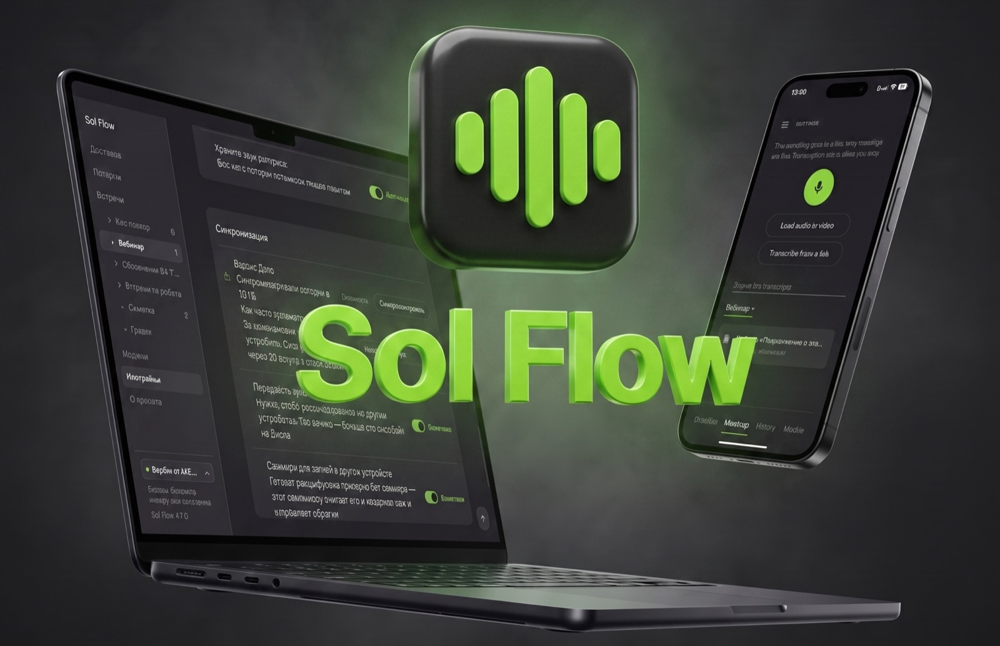

<p align="center">
  
</p>

# Sol Flow

[Русский](README.md) · **English**

Speech recognition that never leaves your device. Dictation into any input
field and meeting transcription — on Mac, Windows and Android. Free, with no
subscription and no uploading of audio anywhere: the models run right on
your computer or phone, and the internet is needed once, to download them.

The app's interface is available in Russian and English. The website and
the release notes are in Russian.

**Website with screenshots and setup steps:** [ivansolomin.ru/solflow](https://ivansolomin.ru/solflow)
· **Latest version:** [Releases](https://github.com/isoloma-ux/solflow/releases/latest)

## Download

One version number covers all three platforms; the files live in the latest
release.

| System | Requirements | File in the release |
|---|---|---|
| Mac | Apple silicon (M1 or newer), macOS 12 or later | `SolFlow_X.Y.Z_macOS.zip` |
| Windows | 64-bit Windows 10 or 11 | `SolFlow_X.Y.Z_x64-setup.exe` |
| Android | Android 8.0 or later, 64-bit processor | `SolFlow_X.Y.Z.apk` |

The app is not in the app stores and is not signed with Apple or Microsoft
certificates, so each system asks a question or two on the first launch.
Step-by-step with screenshots (in Russian) on the
[installation page](https://ivansolomin.ru/solflow#install). In short:

- **Mac.** Unpack, drag into Applications, launch. On the "Sol Flow was not
  opened" window press Done, then System Settings → Privacy & Security →
  Open Anyway. Allow the microphone and enable Accessibility (without it the
  text lands in the clipboard instead of the input field).
- **Windows.** Run the installer; in the SmartScreen window click More info →
  Run anyway. Allow the microphone.
- **Android.** Allow installing from this source, then Settings → Apps →
  Sol Flow → ⋮ → Allow restricted settings, after which enable Sol Flow in
  Accessibility and allow display over other apps. On Xiaomi also enable
  autostart and lift the battery restrictions.

After installing, open Models and download one for your language. For
Russian — GigaAM v3, about 270 MB; for English — Parakeet TDT 0.6B. The app
finds updates itself and offers to install them.

## What it does

- **Dictation into any app.** On the computer — a keyboard shortcut
  (Option+Space on Mac, Ctrl+Space on Windows by default): press, speak, the
  text lands in the active field. On the phone — a floating button that
  comes with the keyboard. Filler words can be dropped, sending a message can
  be automated.
- **Meetings.** Hours of recording with pause, transcription after you stop
  with time markers, search across all recordings that jumps to the exact
  line. Transcriptions run in a queue; any job can be cancelled.
- **Speakers.** Diarization by voice: the app compares timbres rather than
  words, so it works in any language. Speakers can be renamed, the names go
  into the export.
- **Summary and title.** On Mac and Windows a local language model turns the
  transcript into a detailed summary by topic and names the recording by its
  content. The model downloads once on your confirmation; on Windows the
  NVIDIA or AMD graphics card does the computing.
- **Projects.** Recordings go into folders; drag a recording onto
  "+ Project" and the folder is created.
- **Sync through your own Yandex.Disk.** Meetings and projects are the same
  on the phone and the computer; the app has no server of its own. The phone
  records and transcribes, the computer writes the summary and the title and
  sends them back. Audio is sent by a separate switch.
- **Your own recordings.** Import audio and video from disk, transcribe by
  link (on the computer also YouTube and VK through a separate downloader).
- **Export.** txt, markdown, pdf and docx; several meetings as separate
  files or one; the summary and the wav audio separately. The phone has the
  system Share sheet.
- **Ask the recording.** On Mac and Windows there is a field under the
  summary: "what was decided about the budget", "which deadlines did Sergey
  name". The same local model answers, and the times in the answer lead to
  the lines.
- **Recording type and breakdowns.** The model detects what it is looking
  at: a meeting, a webinar or lecture, an interview or podcast. The summary
  and the "Break down" menu adapt to the type: decisions and tasks, a
  follow-up letter, an outline with timecodes, key points, advice, cases and
  numbers, questions and answers, quotes, about the guest, a glossary, a
  recap for a post.
- **Model catalogue.** Fifty models covering a hundred and three languages,
  with search and a language filter; downloads run in the background,
  several at once, with cancel.
- **Updates.** The app checks for a new version, tells you with a
  notification and installs it itself.

## How to use it

**Dictation.** Put the cursor into any field, press the shortcut (or the
button on the phone), speak. A short press records until the next press,
holding records while you hold. The text is pasted by itself; the dictation
history is kept in the app, with audio if you wish.

**Meeting.** The Meetings tab → the record button. It can be paused, on
Android from the notification shade. After you stop, transcription starts
by itself; inside an open meeting — speakers, summary, search in the text,
export.

**Models.** Several models can sit side by side, switching takes seconds.
On phones with Qualcomm and Samsung processors take the F16 variant: it is
faster than the compressed Q4, because the processor computes fp16
directly.

**Sync.** Settings → Connect Yandex.Disk: the login code is copied to the
clipboard at once, three steps in one window. The data lives in the app's
folder on your Disk; the exchange goes directly between your devices and
the Disk.

## About the models

The main one for Russian is **GigaAM v3 e2e-ctc** (Sber): twenty times
faster than real time on a Xiaomi 15, over a hundred times on Apple silicon
with Metal. For English — Parakeet TDT 0.6B, for two dozen European
languages — Parakeet v3 and Canary 1B v2, for rare languages — Whisper
(slower). All models are GGUF files for
[transcribe.cpp](https://github.com/handy-computer/transcribe.cpp); the
catalogue is inherited from [Handy](https://github.com/cjpais/Handy).

Measured along the way: size does not predict speed (Parakeet at 463 MB is
twelve times faster than Whisper Medium at 481 MB), and the F16 variant on a
phone is faster than the quantized Q4.

## Repository layout

| Folder | What it is |
|---|---|
| `app-android/` | The Android app: Kotlin, package `com.handy.voice`, the engine through JNI |
| `desktop/` | The Mac and Windows app: Tauri 2 + Rust, the interface in plain HTML/CSS/JS without bundlers |
| `desktop/src-tauri/src/sync/` | The Yandex.Disk sync protocol (mirrored in `SyncEngine.kt`) |
| `tcpp/` | [transcribe.cpp](https://github.com/handy-computer/transcribe.cpp) — the recognition engine, built for arm64 |
| `sherpa-onnx/` | [sherpa-onnx](https://github.com/k2-fsa/sherpa-onnx) — speaker diarization |
| `llama.cpp/`, `desktop/src-tauri/llama-shim/` | The local language model for summaries (desktop only) |
| `build-catalog.py` | Prepares the model catalogue for the apps |
| `.github/workflows/` | Checks on every push and the release build on a tag |

The development rules, above all platform parity, are in
[CLAUDE.md](CLAUDE.md) (in Russian).

## Building

**Android** (JDK 17, Android SDK with NDK and cmake):

```bash
cd app-android && gradle assembleRelease --no-daemon
```

Build release only: in debug the native code is compiled without
optimizations and runs dozens of times slower.

**Mac and Windows** (Rust, `@tauri-apps/cli`; on Mac the Xcode command line
tools, on Windows the Vulkan SDK for computing summaries on the GPU):

```bash
cd desktop/src-tauri && cargo tauri build
```

The full list of steps, including building sherpa-onnx and the summary
library, is in `.github/workflows/release.yml`: the release is built exactly
that way.

**Release** — push a `vX.Y.Z` tag: CI builds Windows, Mac and the APK, puts
everything into one GitHub release and updates the `latest.json` manifest
the apps update themselves from.

## Deliberate platform differences

- Summaries and automatic titles are computed only on the desktop: the
  language model is too heavy for a phone. The phone receives them through
  sync.
- The Share sheet exists only on Android; on the computer — export to a
  file.
- Transcribing YouTube and VK — only on the computer (needs yt-dlp).

## Built on

- [Handy](https://github.com/cjpais/Handy) by cjpais — the idea, the model
  catalogue and the text cleanup logic.
- [transcribe.cpp](https://github.com/handy-computer/transcribe.cpp) —
  recognition; [sherpa-onnx](https://github.com/k2-fsa/sherpa-onnx) —
  speakers; [llama.cpp](https://github.com/ggml-org/llama.cpp) — summaries.
- The GigaAM (Sber), Parakeet and Canary (NVIDIA) and Whisper (OpenAI)
  models.

## Author and support

The app was put together by [Ivan Solomin](https://ivansolomin.ru) — a
marketer, not a developer — in a dialogue with neural networks and first of
all for his own tasks. A bug report lives inside the app in the About
section; email —
[me@isoloma.ru](mailto:me@isoloma.ru?subject=Sol%20Flow). The app is free
and will stay that way; the project can be supported on
[DonationAlerts](https://www.donationalerts.com/r/isoloma).
