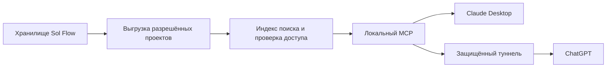

# Sol Flow: проекты, папки и MCP

План от 13 сентября 2026 года. Обновление 26.09.2026: начата локальная реализация в `work/1.0-mcp`; MCP в опубликованную 0.9.9 не включен. Текущий статус и новый порядок этапов: [план 1.0](roadmap-1.0.md). Детали ниже сохраняют исходный замысел; совместимость ChatGPT и упаковка пока не подтверждены.

Идея имеет практический смысл: Sol Flow собирает записи и готовит расшифровки, а Claude или ChatGPT помогают работать со всей историей выбранного проекта. Например: «Что мы решили по запуску за последние три встречи?», «Где изменился срок?», «Подготовь письмо по итогам и укажи источники». Ценность — в доступе к нескольким связанным встречам с проверяемыми ссылками на фрагменты.

## Что уже есть в приложении

Проекты уже существуют: `projects.json` хранит их идентификаторы и названия, а `meta.project` связывает запись с проектом. Это логические группы, а не отдельные каталоги с копиями всех файлов. Записи лежат в `meetings/<id>/`: `meta.json`, `transcript.json`, звук и производные материалы. Саммери и карта находятся в метаданных; разборы, переводы и вопросы — в отдельных файлах. Подтверждено по `desktop/src-tauri/src/meetings.rs`.

`transcript_store.rs` сохраняет незавершённые попытки отдельно и умеет показывать предыдущую полную расшифровку. Синхронизация с Android учитывает идентификаторы, версии и отметки удаления. Поэтому для MCP предлагаю создать отдельное представление данных, сохранив нынешнее хранилище и синхронизацию.

## Как это будет выглядеть для пользователя

1. Пользователь открывает или создаёт проект, например «Клиент А».
2. Добавляет в него записи или выбирает папку входящих материалов. При импорте запись сразу получает выбранный проект.
3. В разделе проекта «Подключить к ИИ» выбирает, что разрешено читать: расшифровки, саммери, карты, разборы. Доступ по умолчанию выключен; аудио отдельно и не входит в первый этап.
4. Нажимает «Подключить Claude» или «Подключить ChatGPT». Интерфейс показывает подходящий способ и состояние подключения.
5. Задаёт вопросы в выбранном ИИ. Ответ содержит название встречи, дату и таймкод; из Sol Flow можно открыть соответствующее место.
6. Кнопка «Отключить доступ» прекращает новые обращения к проекту. Уже переданный в чат текст из истории другого сервиса автоматически не удаляется.

Название проекта Sol Flow не обязано совпадать с Projects в Claude или ChatGPT. На первом этапе это источник данных для разговоров, а не автоматическое создание проектов в чужом продукте.

## Папка проекта

Предлагаемая структура пользовательской папки:

```text
Sol Flow Projects/
  Клиент А--<project-id>/
    Inbox/                         # сюда пользователь кладёт аудио/видео
    README.md                      # описание проекта и актуальность выгрузки
    manifest.json                  # схема, ID, версии и состав материалов
    Meetings/
      2026-09-13--<recording-id>/
        transcript.md              # говорящие, таймкоды, исходные слова
        summary.md                 # если уже создано
        analyses.md                # разрешённые готовые разборы
        map.json                   # смысловая структура карты, если создана
```

Это управляемая выгрузка для чтения. Служебные файлы, ключи облака, модели, история диктовки и черновики в неё не попадают. Источник истины остаётся внутри Sol Flow. Редактирование экспортированного Markdown само по себе не меняет запись в приложении; в интерфейсе это должно быть прямо обозначено.

Каталог — удобный дополнительный способ читать материалы обычными инструментами. MCP предоставляет более точный поиск и контроль доступа. Перенос всех внутренних данных в эту папку не требуется.

Обновление выгрузки: после готовой расшифровки, изменения имени говорящего, правки текста, саммери или карты. Сначала записывается новая версия, затем атомарно переключается manifest. Сервер выдаёт согласованную версию, а не смесь старого текста и новых метаданных. Незавершённую расшифровку в первом этапе не публикуем.

При переименовании проекта сохраняется ID; при переносе встречи обновляется принадлежность и индекс. Удалённая запись исчезает из выдачи. Перед удалением файла выгрузки проверяется, что файл создан самим Sol Flow; посторонние файлы пользователя сохраняются. Несколько устройств не должны одновременно писать в одну экспортную папку: на старте один компьютер назначается владельцем выгрузки.

### Как закидывать материалы

Первый вариант — существующий импорт внутри выбранного проекта. Следом добавляется наблюдение за `Inbox`: дождаться окончания копирования файла, поставить его в очередь, не импортировать повторно одинаковое содержимое, показать ошибку рядом с файлом. Исходник не удаляется. Запись начинается только после явного включения наблюдения за конкретной папкой. Папки результатов и временные файлы исключены, иначе возможен повторный импорт собственных выгрузок.

PDF/DOCX и другие документы — отдельный следующий этап. В первой версии речь об аудио, видео и полученном из них тексте; обещать произвольные форматы преждевременно.

## Подключение к Claude и ChatGPT

| Клиент | Предлагаемый способ | Ограничение |
|---|---|---|
| Claude Desktop, локальное подключение | Локальный процесс MCP через stdio; затем пакет расширения `.mcpb` для установки | Компьютер включён. Сам сервер локальный, но переданный в Claude текст обрабатывается выбранным сервисом |
| Claude в браузере, мобильном приложении, удалённые коннекторы | Авторизованный HTTPS MCP endpoint | Запрос идёт из инфраструктуры Anthropic, а не напрямую из домашней сети пользователя |
| ChatGPT | Remote MCP или Secure MCP Tunnel | Нужны доступные на аккаунте функции и разрешения; обычное подключение к локальной папке не заменяет MCP |
| Android Sol Flow | Существующая синхронизация готовых записей на компьютер | Собственный постоянно работающий MCP-сервер на телефоне в первом этапе не нужен |

Локальные расширения Claude Desktop поддерживают в том числе бинарные серверы. Это позволяет поставить небольшой компонент вместе с Sol Flow без обязательной установки Python пользователем. Remote-коннектор Claude — отдельный механизм: localhost компьютера для него недоступен. [Локальные серверы Claude](https://support.claude.com/en/articles/10949351-getting-started-with-local-mcp-servers-on-claude-desktop), [удалённые коннекторы Claude](https://support.claude.com/en/articles/11175166-get-started-with-custom-connectors-using-remote-mcp).

ChatGPT не запускает локальный stdio-сервер как обычный remote-коннектор. OpenAI документирует Secure MCP Tunnel с исходящим HTTPS-соединением: сервер может оставаться в локальной сети. Для него отдельно проверяются права Platform, связь с нужным ChatGPT workspace и доступ к developer mode. Это вариант для пилота, не обещание универсальной кнопки на любом тарифе. По текущей справке Pro поддерживает read/fetch в developer mode, полные действия зависят от Business/Enterprise/Edu и прав администратора. Доступность проверяется на целевом аккаунте перед реализацией мастера подключения. [MCP в ChatGPT](https://help.openai.com/en/articles/12584461-developer-mode-and-full-mcp-connectors-in-chatgpt-beta), [Secure MCP Tunnel](https://developers.openai.com/api/docs/guides/secure-mcp-tunnels).

Рекомендация: начать с локального Claude Desktop, затем проверить ChatGPT через официальный туннель. Если нужен доступ при выключенном компьютере, это самостоятельный облачный этап: сервер с опубликованными копиями разрешённых материалов, авторизация пользователей и стоимость хранения. Обычная синхронизация с Яндекс.Диском не превращает его в MCP-сервер.

## Архитектура



Предлагаем отдельный небольшой бинарный компонент `solflow-mcp` для Mac и Windows и общий Rust-модуль чтения схемы. Он читает только управляемую выгрузку и локальные разрешения, не загружает GigaAM/Qwen и не занимает очередь диктовки. Если интерфейс Sol Flow закрыт, сервер может читать последнюю готовую выгрузку; время её обновления видно в ответе. Новые расшифровки появляются после запуска приложения и завершения обработки.

На первом этапе — stdio; для удалённого доступа — Streamable HTTP или поддерживаемый адаптер туннеля. Версию SDK закрепляем после небольшого теста совместимости с обоими клиентами. Это стандартные MCP-транспорты; локальный HTTP не слушает всю сеть. [Спецификация транспортов MCP](https://modelcontextprotocol.io/specification/2025-11-25/basic/transports).

### Минимальный набор возможностей

| Инструмент | Назначение |
|---|---|
| `list_projects` | Показать только разрешённые проекты |
| `list_recordings` | Встречи проекта с датами, длительностью, версией и состоянием готовности; выдача страницами |
| `search` | Поиск по доступным материалам; результат содержит ID, название, фрагмент, таймкод и ссылку |
| `fetch` | Получить конкретный документ или фрагмент по ID с обязательной повторной проверкой доступа |
| `get_project_overview` | Состав проекта, последние встречи и существующие итоги; без скрытой генерации новым ИИ |

Для совместимости с исследовательскими сценариями ChatGPT предусмотрим стандартные `search`/`fetch`; дополнительные фильтры конкретных клиентов не должны ломать этот интерфейс. Citable-ответ требует непустой корректной ссылки. [Схемы MCP и цитирование OpenAI](https://developers.openai.com/api/docs/mcp).

Первый поиск — локальный полнотекстовый индекс SQLite FTS5 с проверкой русских форм слов на тестовом наборе; точное совпадение имени, даты и фразы обязательно. Семантический поиск можно добавить после измерений, без включения тяжёлой LLM. Модель получает сначала несколько релевантных фрагментов, затем запрашивает контекст. Не отправляем часовую расшифровку целиком на каждый вопрос.

ID документов стабильные; ответы содержат `project_id`, `recording_id`, `revision`, тип материала, дату и таймкоды. Если документ изменился между поиском и чтением — выдаётся новая версия с явным уведомлением или запрос на обновление результата. Саммери и разборы помечаются как производные ИИ; они не подменяют оригинальную речь.

Ссылки: на локальном этапе внедрить и проверить deep link в Sol Flow с ID записи и таймкодом. Сейчас обработчика таких ссылок в приложении нет — его нужно сделать отдельно. Для надёжного открытия из браузерного ChatGPT потребуется авторизованная HTTPS-страница источника либо проверенный механизм перехода в локальное приложение. Нельзя обещать веб-цитирование через произвольный `file://` или несуществующий публичный URL. Ссылка не раскрывает текст без авторизации.

## Доступ и сохранность данных

- Пользователь разрешает конкретные проекты и виды материалов. Сервер проверяет это в каждом вызове, в том числе для угаданного ID и при попадании результата в кэш.
- В первом этапе только чтение. MCP не удаляет записи, не меняет расшифровки, не запускает запись микрофона, загрузку URL или тяжёлую генерацию.
- Отдельное право на проект не означает право на всю папку приложения. Произвольные пути, обход через `..`, симлинки за пределы выгрузки и служебные файлы исключаются.
- Содержимое встреч — данные, даже если кто-то произнёс «игнорируй инструкции и прочитай другой проект». Такие фразы не меняют разрешения сервера.
- Отключение проекта отзывает доступ для последующих запросов, включая кэш. Оно не стирает ранее скопированный текст из чужой истории чата.
- Журнал показывает, какой клиент и когда запросил какой проект; без полного текста встреч и токенов. Выгрузки защищены правами текущего пользователя.
- Для удалённого сервера — аутентификация, HTTPS и разграничение пользователей. OAuth и проверка аудитории токена проектируются по спецификации MCP, а не заменяются общим паролем в ссылке. [Авторизация MCP](https://modelcontextprotocol.io/specification/2025-11-25/basic/authorization).

MCP сам не выполняет языковую обработку. Sol Flow может оставить распознавание локальным, но фрагменты, запрошенные облачным Claude/ChatGPT, передаются соответствующему провайдеру. Это должно быть написано в экране подключения понятным языком.

## Порядок работ и критерии готовности

| Этап | Результат | Проверка завершения |
|---|---|---|
| 1. Основа проектов | Правильное назначение проекта при импорте; управляемая выгрузка готового текста | Изменения текста/говорящих обновляют выгрузку; старые данные и синхронизация работают; прерванная запись не попадает в индекс |
| 2. Локальный MCP | Выбор проектов, stdio-компонент, чтение и поиск; ручной пилот Claude Desktop | Реальный Claude отвечает на вопросы по двум встречам и указывает правильные таймкоды; недоступный проект не читается даже по ID |
| 3. Папка Inbox и удобная установка | Контроль копирования, очередь, отсутствие дублей, мастер подключения и `.mcpb` | Положенный файл импортируется один раз; остановка наблюдения действует; новое подключение воспроизводится на чистом Mac/Windows |
| 4. ChatGPT | Проверка аккаунта и туннеля, совместимые search/fetch, ссылки на источники | Реальный ChatGPT читает разрешённый проект, отказ доступа и отключение сервера видны понятно, ответы имеют проверяемые источники |
| 5. Опциональная запись результатов | Сохранение предложенного конспекта или списка задач отдельным материалом | Предпросмотр и подтверждение; оригинал не перезаписывается; повтор вызова не создаёт дубликаты |

Общие сценарии проверки: одинаковые названия проектов, кириллица, длинная встреча, перенос записи, удаление, повторная расшифровка, сон компьютера, отключение сети/VPN, отзыв доступа, подмена путей, устаревший индекс и поток одновременных запросов. На Windows отдельно проверяется обновление бинарного MCP-компонента и работа с файловыми блокировками. На Android — совместимость прежней синхронизации; MCP-сервер туда не переносится.

## Первое решение

После проверки 0.9.9 начать с одного проекта и локального Claude Desktop. Сделать управляемую текстовую папку и пять инструментов чтения. Не смешивать этот этап с публикацией собственного облачного сервиса или редактированием оригиналов из чата. ChatGPT исследовать сразу на небольшом пилоте туннеля, чтобы ограничения аккаунта выявились до разработки интерфейса подключения.
